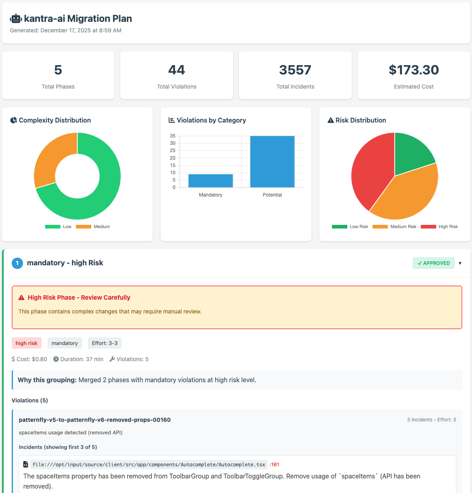

# kantra-ai

[](https://github.com/tsanders-rh/kantra-ai/actions/workflows/test.yml)
[](https://codecov.io/gh/tsanders-rh/kantra-ai)
[](https://goreportcard.com/report/github.com/tsanders-rh/kantra-ai)

AI-powered automated remediation for [Konveyor](https://www.konveyor.io/) violations. Use Claude or OpenAI to automatically fix code issues identified during application modernization and migration.

## Features

- 🤖 **AI-Powered Fixes** - Automated code remediation using Claude, OpenAI, or 50+ other providers
- 📋 **Phased Migration Planning** - AI-generated migration plans with risk assessment and execution order
- 🌐 **Interactive Web UI** - Modern interface for reviewing and approving phases with visual charts and live execution monitoring
- 📊 **Visual Reports** - Beautiful HTML reports with diff highlighting and code annotations
- ⚡ **Batch Processing** - 50-80% cost reduction and 70-90% faster execution
- 🎯 **Confidence Filtering** - Skip low-confidence fixes based on migration complexity
- 🔄 **Resume Capability** - Continue from failures with incident-level state tracking
- 🔧 **Customizable Prompts** - Per-language prompt templates for technology-specific migrations
- 💰 **Cost Controls** - Set spending limits and track API costs per fix
- 🔐 **Git Integration** - Automatic commits and GitHub PR creation
- ✅ **Verification** - Run tests/builds after fixes to ensure they work

## Quick Start

### Prerequisites

- Go 1.21 or higher
- AI provider API key ([Claude](https://console.anthropic.com/settings/keys), [OpenAI](https://platform.openai.com/api-keys), or [others](docs/guides/AI_PROVIDERS.md))
- Konveyor analysis output (`output.yaml`)

```bash
# Set your AI provider API key
export ANTHROPIC_API_KEY=sk-ant-...  # For Claude (recommended)
# or
export OPENAI_API_KEY=sk-...         # For OpenAI
```

### Installation

```bash
git clone https://github.com/tsanders-rh/kantra-ai
cd kantra-ai
go build -o kantra-ai ./cmd/kantra-ai
```

Or install directly:

```bash
go install github.com/tsanders-rh/kantra-ai/cmd/kantra-ai@latest
```

### Basic Usage

1. **Run Konveyor analysis** on your application:
   ```bash
   kantra analyze --input=./your-app --output=./analysis
   ```

2. **Preview fixes** with dry-run mode:
   ```bash
   ./kantra-ai remediate \
     --analysis=./analysis/output.yaml \
     --input=./your-app \
     --dry-run
   ```

3. **Apply fixes** with a cost limit:
   ```bash
   ./kantra-ai remediate \
     --analysis=./analysis/output.yaml \
     --input=./your-app \
     --max-cost=5.00
   ```

**See:** [Quick Start Guide](docs/guides/QUICKSTART.md) | [Usage Examples](docs/guides/USAGE_EXAMPLES.md)

---

## Two Workflows

### 1. Direct Remediation (Quick Fixes)

For small migrations with < 20 violations:

```bash
./kantra-ai remediate \
  --analysis=./analysis/output.yaml \
  --input=./your-app \
  --provider=claude
```

**Best for**: Simple migrations, testing, proof-of-concept

### 2. Phased Migration (Large-Scale)

For larger migrations with 20+ violations, use the `plan` → `execute` workflow:

**Step 1: Generate a plan**

```bash
./kantra-ai plan \
  --analysis=./analysis/output.yaml \
  --input=./your-app \
  --interactive-web  # Launch web UI for interactive planning
```

Or use CLI mode:

```bash
./kantra-ai plan \
  --analysis=./analysis/output.yaml \
  --input=./your-app \
  --provider=claude

# Output:
# Created: .kantra-ai-plan/plan.yaml
# Report:  .kantra-ai-plan/plan.html
```

**Step 2: Review the plan**

```bash
# View interactive HTML report
open .kantra-ai-plan/plan.html
```

<p align="center">
  
</p>

**The HTML report includes:**
- Summary dashboard with metrics and charts
- Risk indicators (low/medium/high)
- Side-by-side code diffs
- Collapsible phase details
- Same styling as web UI

**Step 3: Execute the plan**

```bash
./kantra-ai execute \
  --plan=.kantra-ai-plan/plan.yaml \
  --input=./your-app \
  --provider=claude
```

**Step 4: Resume from failures** (if needed)

```bash
./kantra-ai execute \
  --plan=.kantra-ai-plan/plan.yaml \
  --input=./your-app \
  --resume
```

**Benefits**:
- AI-powered grouping by risk, category, and effort
- Incremental execution (one phase at a time)
- Resume capability with state tracking
- Interactive approval and review

**See:** [Web UI Guide](docs/WEB_INTERACTIVE_USAGE.md) | [Web UI Quick Reference](docs/WEB_UI_QUICK_REFERENCE.md)

---

## Configuration

Create a `.kantra-ai.yaml` file to avoid repetitive flags:

```yaml
# .kantra-ai.yaml
provider:
  name: claude
  model: claude-sonnet-4-20250514

paths:
  analysis: ./analysis/output.yaml
  input: ./src

limits:
  max-cost: 10.00

git:
  commit-strategy: per-violation
  create-pr: true

verification:
  enabled: true
  type: test
  strategy: at-end
```

**Configuration priority**: CLI flags > `./.kantra-ai.yaml` > `~/.kantra-ai.yaml` > defaults

**See:** [Example config](.kantra-ai.example.yaml) | [Prompt Customization](docs/guides/PROMPT_CUSTOMIZATION.md)

---

## Key Features

### AI Provider Support

kantra-ai supports 50+ LLM providers:

- **Claude** (Anthropic) - Recommended for highest quality
- **OpenAI** - GPT-4, GPT-3.5 Turbo
- **Groq** - Ultra-fast inference
- **Ollama** - Free local models
- **Together AI**, **Anyscale**, **Perplexity**, **OpenRouter**, **LM Studio**
- Any OpenAI-compatible API

```bash
# Claude (recommended for production)
./kantra-ai remediate --provider=claude

# Groq (fast, great for testing)
./kantra-ai remediate --provider=groq --model=llama-3.1-70b-versatile

# Ollama (free, local, private)
ollama serve
./kantra-ai remediate --provider=ollama --model=codellama
```

**See:** [AI Providers Guide](docs/guides/AI_PROVIDERS.md)

---

### Batch Processing

Automatically groups similar violations for 50-80% cost reduction and 70-90% faster execution:

```
Without batching: 100 violations × $0.10 = $10.00, ~50 minutes
With batching:     100 violations ÷ 10 × $0.10 = $1.00, ~8 minutes
Savings:          $9.00 (90% reduction), 42 minutes (84% faster)
```

Batching is enabled by default. Customize with:

```bash
./kantra-ai remediate --batch-size=10 --batch-parallelism=4
```

**See:** [Batch Processing Design](docs/design/BATCH_PROCESSING_DESIGN.md)

---

### Confidence Filtering

Skip low-confidence fixes based on migration complexity:

```bash
./kantra-ai remediate \
  --enable-confidence \
  --on-low-confidence=skip
```

| Complexity | Threshold | Description |
|------------|-----------|-------------|
| trivial | 0.70 | Mechanical find/replace |
| low | 0.75 | Straightforward API equivalents |
| medium | 0.80 | Requires context understanding |
| high | 0.90 | Architectural changes |
| expert | 0.95 | Domain expertise required |

**See:** [Confidence Filtering Guide](docs/guides/CONFIDENCE_FILTERING.md)

---

### Git Integration

Automatic commit creation and GitHub PR automation:

```bash
# Single commit with all fixes
./kantra-ai remediate --git-commit=at-end --create-pr

# One commit per violation type
./kantra-ai remediate --git-commit=per-violation --create-pr
```

PRs include detailed summaries, file breakdowns, and cost metrics.

**See:** [PR Testing Guide](docs/guides/PR-TESTING-GUIDE.md)

---

### Verification

Run tests or builds after fixes to ensure they work:

```bash
# Run tests after all fixes
./kantra-ai remediate --verify=test

# Run build only (faster)
./kantra-ai remediate --verify=build

# Custom command
./kantra-ai remediate --verify=test --verify-command="make test"
```

---

## Common Examples

### Filter by Category

```bash
# Only fix mandatory violations
./kantra-ai remediate --categories=mandatory

# Fix mandatory and optional
./kantra-ai remediate --categories=mandatory,optional
```

### Filter by Effort

```bash
# Only fix low-effort violations (≤3)
./kantra-ai remediate --max-effort=3
```

### Safe Production Migration

```bash
./kantra-ai execute \
  --plan=.kantra-ai-plan/plan.yaml \
  --enable-confidence \
  --on-low-confidence=skip \
  --verify=test \
  --git-commit=per-violation \
  --create-pr
```

**See:** [Usage Examples](docs/guides/USAGE_EXAMPLES.md) | [CLI Reference](docs/guides/CLI_REFERENCE.md)

---

## Architecture

```
kantra-ai/
├── cmd/
│   └── kantra-ai/        # CLI entry point (remediate, plan, execute)
├── pkg/
│   ├── violation/        # Konveyor output.yaml parser
│   ├── provider/         # AI provider interface
│   │   ├── claude/       # Claude (Anthropic) implementation
│   │   └── openai/       # OpenAI implementation
│   ├── fixer/            # Code modification engine
│   ├── planner/          # AI-powered plan generation
│   ├── planfile/         # Plan and state YAML management
│   ├── executor/         # Plan execution with resume capability
│   ├── verifier/         # Build/test verification
│   └── gitutil/          # Git & GitHub integration
└── examples/             # Example violations and plans
```

---

## How It Works

1. **Parse Analysis** - Reads Konveyor's `output.yaml` to identify violations
2. **AI Processing** - Sends violation context to AI provider (Claude/OpenAI)
3. **Apply Fixes** - Applies AI-generated fixes to source files
4. **Verification** (optional) - Runs tests or builds to ensure fixes work
5. **Git Integration** (optional) - Creates commits with meaningful messages
6. **PR Creation** (optional) - Opens pull requests on GitHub with summaries
7. **Reporting** - Provides detailed metrics on success rates, costs, and tokens used

**See:** [Complete Workflow Guide](docs/WORKFLOW.md) | [Design Documentation](docs/design/DESIGN.md)

---

## Documentation

### Getting Started
- [Quick Start Guide](docs/guides/QUICKSTART.md)
- [Usage Examples](docs/guides/USAGE_EXAMPLES.md)
- [CLI Reference](docs/guides/CLI_REFERENCE.md)

### Advanced Features
- [AI Providers Guide](docs/guides/AI_PROVIDERS.md)
- [Confidence Filtering](docs/guides/CONFIDENCE_FILTERING.md)
- [Prompt Customization](docs/guides/PROMPT_CUSTOMIZATION.md)
- [Web Interactive Planner](docs/WEB_INTERACTIVE_USAGE.md)
- [Web UI Quick Reference](docs/WEB_UI_QUICK_REFERENCE.md)

### Development
- [Testing Guide](docs/guides/TESTING.md)
- [Contributing Guide](docs/guides/CONTRIBUTING.md)
- [Design Documentation](docs/design/DESIGN.md)
- [Batch Processing Design](docs/design/BATCH_PROCESSING_DESIGN.md)
- [Planning Workflow Design](docs/design/PLANNING_WORKFLOW_DESIGN.md)

---

## Cost Estimation

Typical costs per violation (using Claude Sonnet 4 with batch processing):

- **Simple fixes** (import changes): $0.002 - $0.01
- **Medium complexity** (API migrations): $0.01 - $0.03
- **Complex fixes** (multi-file changes): $0.03 - $0.10

Use `--dry-run` to get cost estimates before applying fixes.

---

## Testing

### Automated E2E Testing

For manual end-to-end testing with a real codebase:

```bash
# Build and run the E2E test script
go build -o kantra-ai ./cmd/kantra-ai
./scripts/test-e2e.sh ~/Workspace/boat-fuel-tracker-j2ee
```

The script automates the entire workflow: analysis → planning → approval → execution → PR creation → cleanup.

**See:** [Test Script Documentation](scripts/README.md)

### Unit & Integration Tests

See [TESTING.md](docs/guides/TESTING.md) for comprehensive testing instructions.

---

## Contributing

Contributions welcome! Please read:
- [Contributing Guide](docs/guides/CONTRIBUTING.md)
- [Design Documentation](docs/design/DESIGN.md)

---

## Roadmap

- [x] Core AI-powered remediation
- [x] Multiple AI provider support (Claude, OpenAI, Groq, Ollama, etc.)
- [x] Git commit automation
- [x] GitHub PR creation
- [x] Build/test verification
- [x] Phased migration planning with AI grouping
- [x] Interactive phase approval (Web UI + CLI)
- [x] Resume capability with state tracking
- [x] Batch processing optimizations (50-80% cost reduction)
- [x] 50+ AI providers support
- [x] Confidence-based filtering
- [x] Customizable prompt templates
- [ ] Native Gemini provider support
- [ ] Integration with Konveyor CLI

---

## License

Apache 2.0

---

**Note**: kantra-ai is an independent tool and is not officially part of the Konveyor project. It's designed to complement Konveyor's analysis capabilities with automated remediation.
