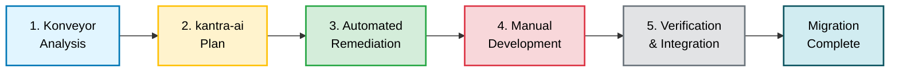
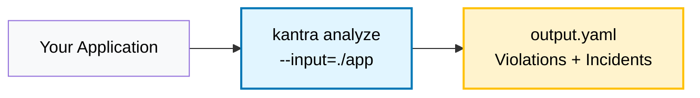
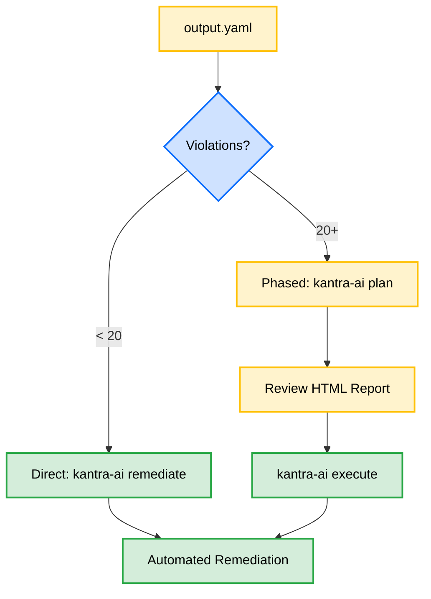
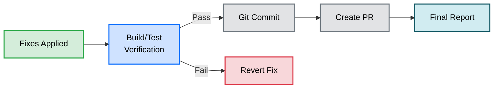
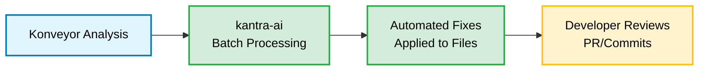
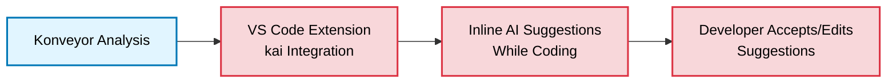
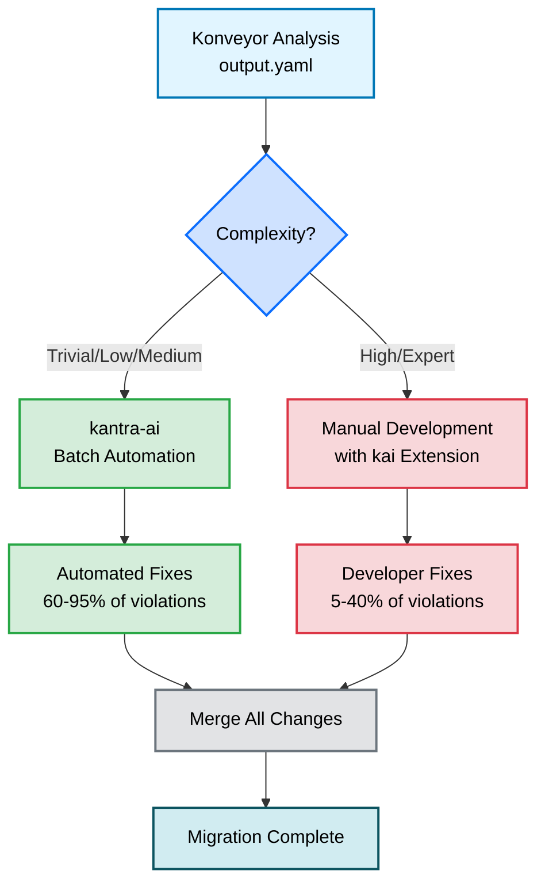

# Complete Migration Workflow

This document illustrates the end-to-end workflow from Konveyor analysis through kantra-ai automated remediation to manual developer activities.

## High-Level Overview



## Detailed Workflow

### 1. Konveyor Analysis



Konveyor analyzes your application and produces `output.yaml` containing violations, incidents, and complexity metadata.

### 2. Planning Workflow



**Small migrations** (< 20 violations): Use `remediate` for quick fixes
**Large migrations** (20+ violations): Use `plan` → `execute` for phased approach

### 3. Complexity-Based Routing


**Key Decision Point**: Migration complexity determines automation vs manual work

| Complexity | AI Success Rate | Action |
|------------|----------------|--------|
| **Trivial** | 95%+ | ✅ Automated (batch) |
| **Low** | 80%+ | ✅ Automated (batch) |
| **Medium** | 60%+ | ✅ Automated (single) |
| **High** | 30-50% | ⚠️ Manual review recommended |
| **Expert** | <30% | ❌ Manual development required |

### 4. Confidence Filtering (Optional Safety Layer)


**Thresholds by Complexity**:
- Trivial: 0.70
- Low: 0.75
- Medium: 0.80
- High: 0.90
- Expert: 0.95

### 5. Verification & Integration



**Optional Steps**:
- **Verification**: Run build/tests after fixes (`--verify=test`)
- **Git Integration**: Auto-commit fixes (`--git-commit=per-violation`)
- **PR Creation**: Create GitHub pull requests (`--create-pr`)

## Tool Ecosystem: kantra-ai vs kai + Editor Extension

The Konveyor ecosystem offers **two complementary approaches** for AI-assisted migration:

### Approach 1: Batch Automation (kantra-ai)



**Best for**:
- Trivial/Low/Medium complexity violations
- Large-scale migrations (100+ violations)
- Automated CI/CD pipelines
- Cost-effective batch processing

**How it works**:
1. Run `kantra-ai remediate` or `kantra-ai execute`
2. AI processes violations in batches
3. Fixes applied automatically to source files
4. Developer reviews changes in PR

### Approach 2: Interactive Assistance (kai + Editor Extension)



**Best for**:
- High/Expert complexity violations
- Manual development work
- Learning migration patterns
- Fine-grained control over changes

**How it works**:
1. Open your code in VS Code with kai extension
2. Extension shows violations inline
3. Request AI fix suggestion with keyboard shortcut
4. Review, edit, and apply suggestion immediately

### Hybrid Workflow: Best of Both Worlds



**Recommended Workflow**:

1. **Run Konveyor analysis** to identify all violations
2. **Use kantra-ai** for automated batch fixes:
   ```bash
   kantra-ai remediate --categories=mandatory --max-effort=6
   ```
   This handles trivial/low/medium complexity violations automatically.

3. **Use kai + VS Code extension** for remaining complex violations:
   - Open files flagged as high/expert complexity
   - Get inline AI suggestions for each violation
   - Manually review and apply changes with full control

4. **Verify and integrate** all changes together

### Comparison Table

| Feature | kantra-ai (Batch) | kai + Extension (Interactive) |
|---------|------------------|------------------------------|
| **Interaction** | CLI, automated | VS Code, manual |
| **Speed** | Very fast (batch processing) | Slower (one-at-a-time) |
| **Cost** | 50-80% cheaper (batching) | Higher (individual API calls) |
| **Control** | Less (automated) | More (developer reviews each) |
| **Best for** | Simple violations | Complex violations |
| **Violations** | 100s or 1000s | 10s or 100s |
| **Learning** | Limited | High (see reasoning) |

### When to Use Each Tool

**Use kantra-ai when**:
- You have many similar violations (e.g., 200 `javax.*` imports)
- Violations are low complexity (mechanical changes)
- You want to minimize cost and time
- You're comfortable with automated batch changes
- You want CI/CD integration

**Use kai + extension when**:
- You have complex violations requiring judgment
- You want to learn migration patterns
- You need fine-grained control over each change
- You're actively developing and want inline help
- You want to understand AI reasoning

**Use both when** (recommended):
- Large migrations with mixed complexity
- You want to automate simple fixes and manually handle complex ones
- You want the best ROI on your time and AI costs

## Workflow Details

### Phase 1: Konveyor Analysis

Konveyor (kantra) analyzes your application and produces `output.yaml` containing:
- **Violations**: Issues found (e.g., "javax.* → jakarta.*")
- **Incidents**: Specific occurrences (file, line number, code snippet)
- **Metadata**: Category (mandatory/optional), effort level (0-10), migration complexity

### Phase 2: Choose Your Workflow

**Direct Remediation** (< 20 violations):
```bash
kantra-ai remediate --analysis=output.yaml --input=./app
```

**Phased Migration** (20+ violations):
```bash
# Step 1: Generate plan
kantra-ai plan --analysis=output.yaml --input=./app

# Step 2: Review HTML report
# Review .kantra-ai-plan.html in browser

# Step 3: Execute approved plan
kantra-ai execute --plan=.kantra-ai-plan.yaml
```

### Phase 3: Automated Remediation

kantra-ai processes violations based on **migration complexity**:

| Complexity | Auto-Fix Strategy | Default Confidence | Example |
|------------|------------------|-------------------|---------|
| **Trivial** | ✅ Automated (batch) | 0.70 | Package renames: `javax.*` → `jakarta.*` |
| **Low** | ✅ Automated (batch) | 0.75 | Simple API equivalents |
| **Medium** | ✅ Automated (single) | 0.80 | Context-aware changes |
| **High** | ⚠️ Manual review recommended | 0.90 | Architectural changes |
| **Expert** | ❌ Manual review required | 0.95 | Domain expertise needed |

**Confidence Filtering** (optional safety layer):
- AI returns confidence score (0.0-1.0) for each fix
- kantra-ai compares against complexity-based threshold
- **Actions for low confidence**:
  - `skip`: Don't apply fix (safest)
  - `warn-and-apply`: Apply with warning
  - `manual-review-file`: Write to ReviewFileName.yaml

**Batch Processing**:
- Groups similar violations together
- Sends up to 10 incidents per batch to AI
- 50-80% cost reduction, 70-90% faster
- Used for trivial/low/medium complexity

### Phase 4: Manual Development

Developers handle:

1. **High/Expert Complexity Violations**
   - Flagged in migration plan
   - Require architectural decisions
   - Need domain expertise

2. **Low-Confidence Fixes** (if manual-review-file enabled)
   - Written to `ReviewFileName.yaml`
   - Developer reviews AI suggestion
   - Decides to apply, modify, or reject

3. **Failed Automated Fixes**
   - Fixes that failed verification
   - Fixes with errors from AI
   - Edge cases AI couldn't handle

### Phase 5: Verification & Integration

**Build/Test Verification** (optional):
```bash
--verify=build  # Run build after fixes
--verify=test   # Run test suite
--verify-strategy=per-fix      # Verify each fix immediately
--verify-strategy=at-end       # Verify once at the end
```

**Git Integration** (optional):
```bash
--git-commit=per-violation  # One commit per violation type
--git-commit=per-incident   # One commit per incident
--git-commit=at-end        # Single commit for all fixes
--create-pr                # Create GitHub PR automatically
```

## Complexity Level Examples

### Trivial (95%+ AI Success, 0.70 threshold)
```java
// Before
import javax.servlet.HttpServlet;

// After
import jakarta.servlet.HttpServlet;
```
**Characteristics**: Mechanical find/replace, no logic changes

### Low (80%+ AI Success, 0.75 threshold)
```java
// Before
Date date = new Date();

// After
LocalDateTime date = LocalDateTime.now();
```
**Characteristics**: Straightforward API equivalents, well-documented migrations

### Medium (60%+ AI Success, 0.80 threshold)
```java
// Before
Properties props = new Properties();
props.load(new FileInputStream("config.properties"));

// After
Properties props = new Properties();
try (InputStream in = Files.newInputStream(Paths.get("config.properties"))) {
    props.load(in);
}
```
**Characteristics**: Requires context understanding, multiple changes, resource management

### High (30-50% AI Success, 0.90 threshold)
```java
// Requires architectural decisions
// - Should we use reactive patterns?
// - What error handling strategy?
// - How to handle state migration?
```
**Characteristics**: Architectural changes, multiple valid approaches, significant refactoring

**Recommendation**: Manual review required

### Expert (<30% AI Success, 0.95 threshold)
```java
// Requires domain expertise
// - Business logic understanding
// - Performance optimization decisions
// - Security/compliance requirements
// - Integration with proprietary systems
```
**Characteristics**: Domain-specific knowledge, business logic, complex integrations

**Recommendation**: Manual development required

## Configuration Examples

### Maximum Safety (Production)
```yaml
# .kantra-ai.yaml
confidence:
  enabled: true
  on-low-confidence: skip
  complexity-thresholds:
    medium: 0.85  # Higher threshold for medium
    high: 0.95    # Very high for complex
    expert: 0.98  # Near-perfect for expert

verification:
  enabled: true
  type: test
  strategy: per-fix
  fail-fast: true

git:
  commit-strategy: per-violation
  create-pr: true
```

### Rapid Development (POC)
```yaml
# .kantra-ai.yaml
confidence:
  enabled: false  # Maximize automation

verification:
  enabled: false  # Skip verification for speed

git:
  commit-strategy: at-end
```

### Balanced Approach (Recommended)
```yaml
# .kantra-ai.yaml
confidence:
  enabled: true
  on-low-confidence: manual-review-file  # Collect for review

verification:
  enabled: true
  type: build
  strategy: at-end  # Fast verification

git:
  commit-strategy: per-violation
  create-pr: true
```

## Cost & Performance Optimization

**Batch Processing** automatically groups similar violations:

| Metric | Single Processing | Batch Processing (10x) | Savings |
|--------|------------------|----------------------|---------|
| **API Calls** | 100 violations = 100 calls | 100 violations = 10 calls | 90% fewer |
| **Cost** | $10.00 | $2.00-$5.00 | 50-80% |
| **Time** | 15 minutes | 2-5 minutes | 70-90% faster |

**When Batch Processing is Used**:
- Trivial complexity violations
- Low complexity violations
- Medium complexity violations (if similar enough)

**When Single Processing is Used**:
- High complexity violations (if auto-fixed)
- Expert complexity violations (if auto-fixed)
- Violations with unique context requirements

## Best Practices

### 1. Start Conservative
```bash
# First run: Dry-run to preview
kantra-ai remediate --dry-run --enable-confidence

# Second run: Limited scope
kantra-ai remediate --categories=mandatory --max-cost=5.00

# Third run: Full automation
kantra-ai remediate --enable-confidence --verify=build
```

### 2. Use Phased Approach for Large Migrations
```bash
# Step 1: Plan
kantra-ai plan --categories=mandatory

# Step 2: Review plan (HTML report)
# Step 3: Execute phase by phase
kantra-ai execute --plan=.kantra-ai-plan.yaml --phases=1
kantra-ai execute --plan=.kantra-ai-plan.yaml --phases=2
```

### 3. Combine Automation with Manual Review
```bash
# Auto-fix low complexity, flag high complexity for review
kantra-ai remediate \
  --enable-confidence \
  --on-low-confidence=manual-review-file \
  --verify=build

# Review: ReviewFileName.yaml contains low-confidence fixes
# Plan: HTML report shows high/expert violations for manual work
```

### 4. Use Verification for Critical Code
```bash
# Production code: Verify each fix
kantra-ai remediate \
  --verify=test \
  --verify-strategy=per-fix \
  --fail-fast

# Test code: Verify at end (faster)
kantra-ai remediate \
  --input=./tests \
  --verify=build \
  --verify-strategy=at-end
```

## Summary

This workflow enables:
- **Automation**: Handle 60-95% of violations automatically (trivial/low/medium)
- **Safety**: Confidence filtering prevents low-quality automated fixes
- **Efficiency**: Batch processing reduces costs by 50-80%
- **Control**: Manual review for complex violations requiring expertise
- **Quality**: Optional build/test verification ensures fixes work
- **Integration**: Git commits and PR creation for team review

**Result**: Faster, safer, more cost-effective migrations with clear separation between automated fixes and manual development work.
